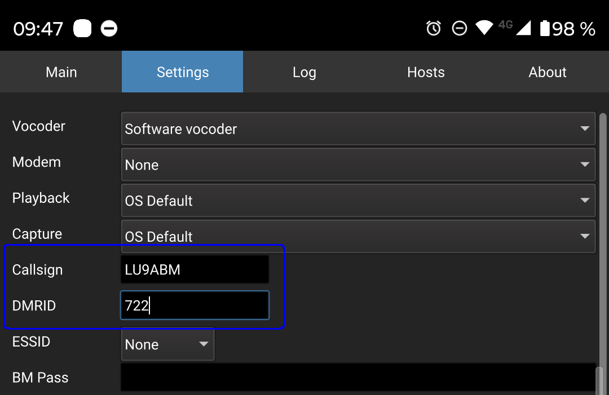
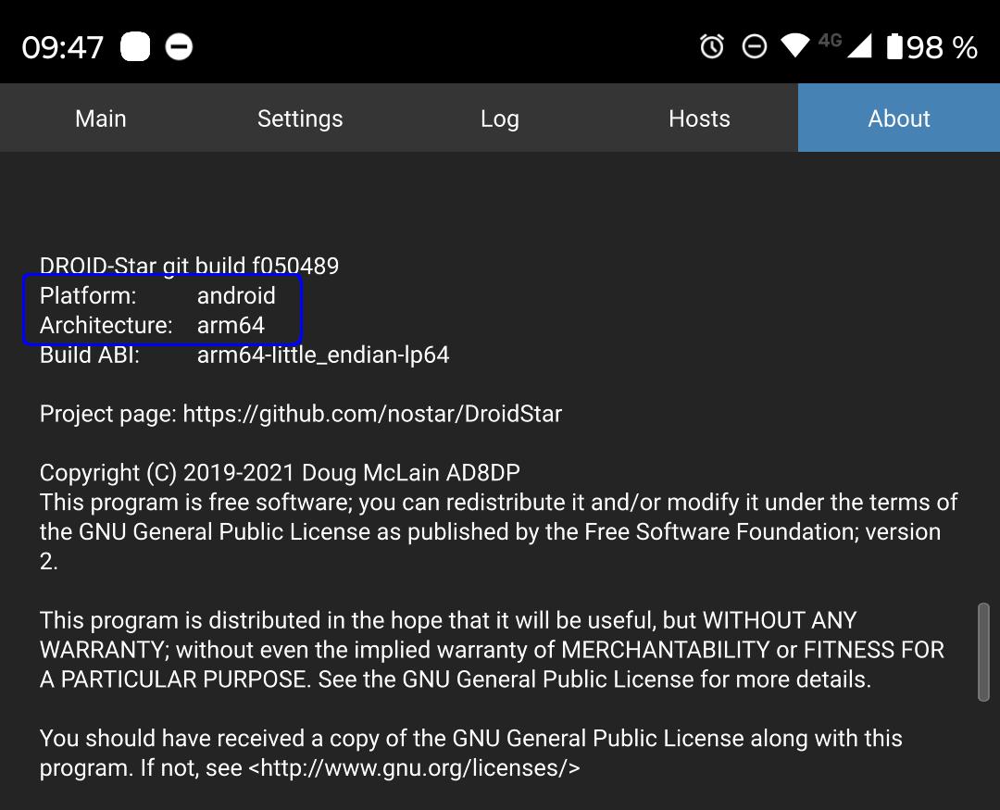
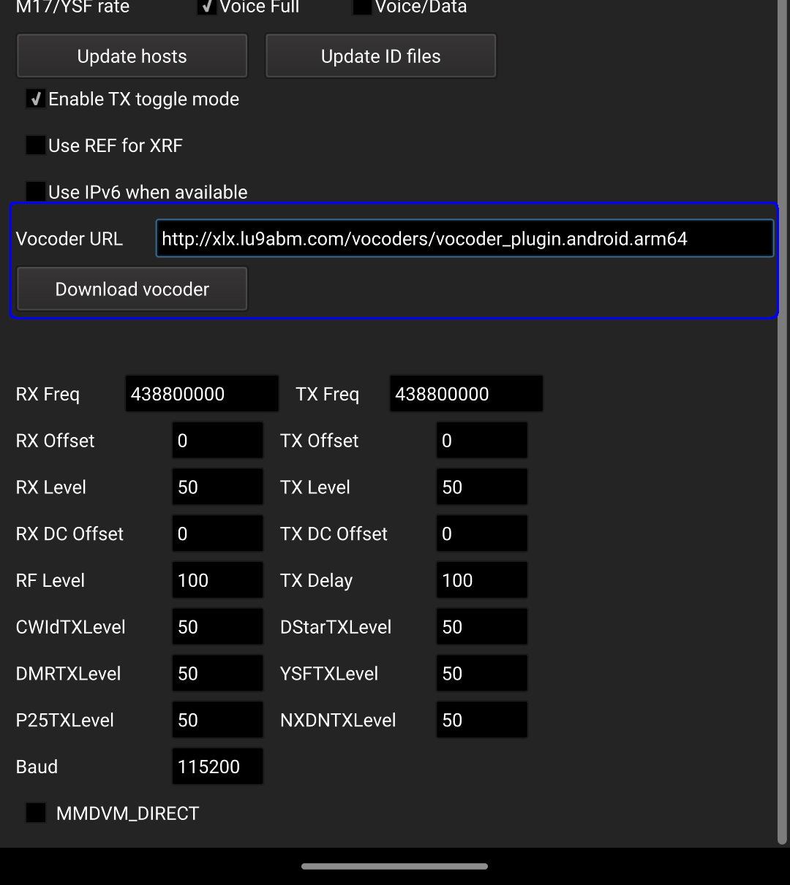
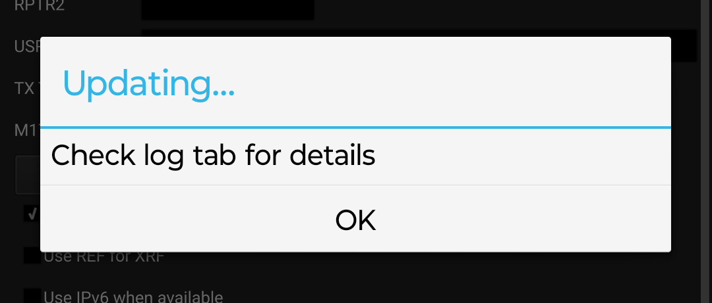
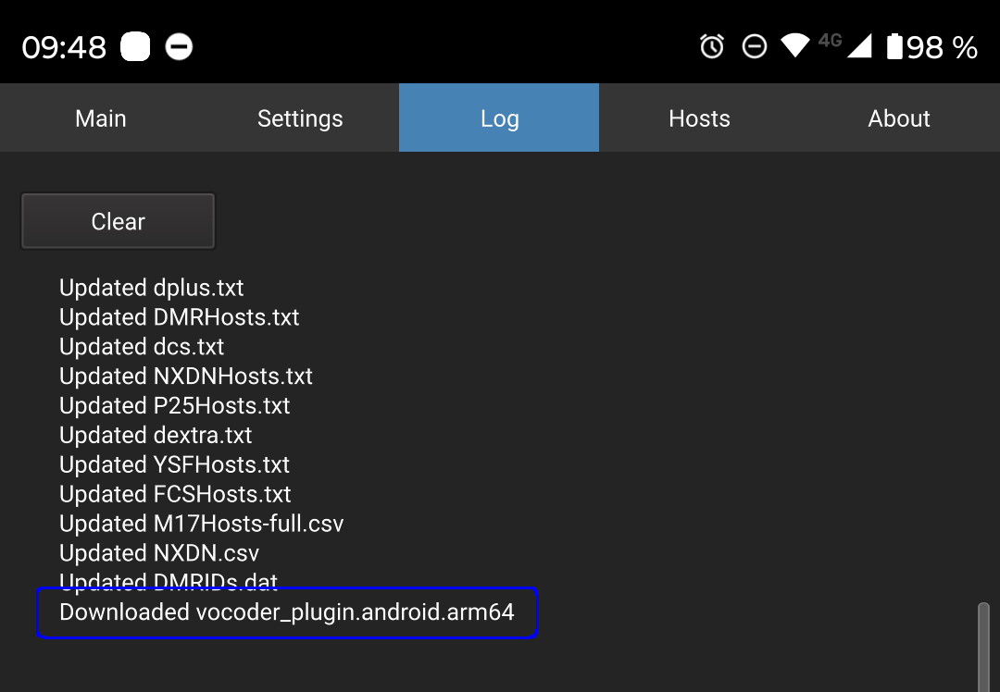
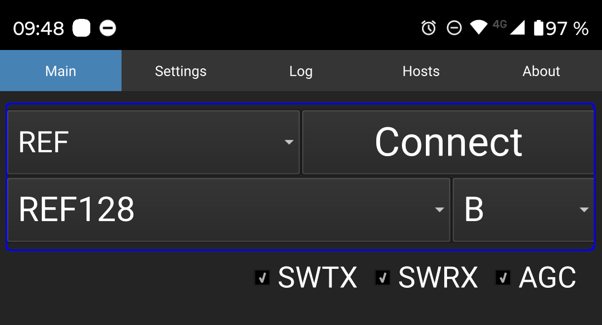
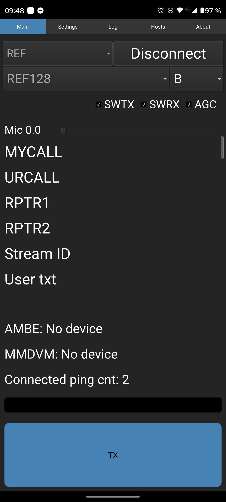
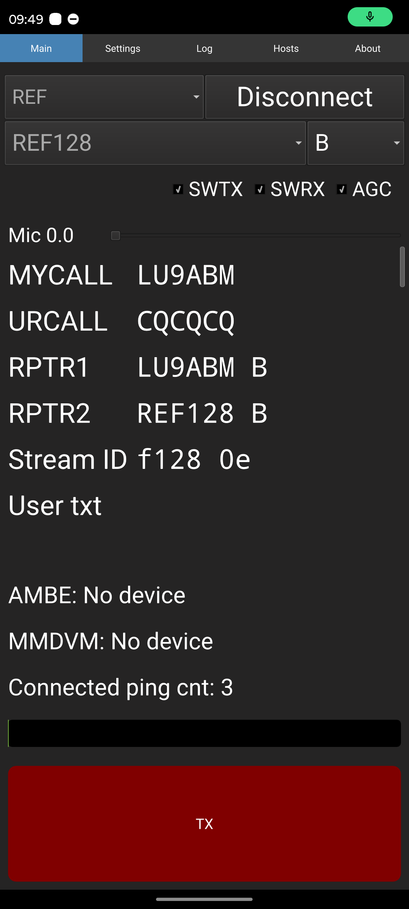

# DroidStar
La idea de esta guía es mostrar cómo configurar DroidStar para los sistemas de D-Star

## Antes de empezar, necesitamos estar registrados en D-Star y contar con un DMRID

Para esta tarea, dejo dos enlaces externos que lo explican muy bien

Registrarse en D-Star: https://www.lu1bjw.net/d-star-argentina/d-star-como-me-registro/

Solicitar un DMRID: https://www.radioaficioncr.net/2020/06/solicitando-id-para-dmr.html

## Para instalar y utilizar la app, hay dos opciones

#### 1- Instalar la app desde el siguiente link, la cual ya cuenta con los vocoders integrados (solo disponible para android y windows)

http://pizzanbeer.net/droidstar/

En este caso, una vez instalada, saltearse al punto [Ya es hora de probar la APP!](#ya-es-hora-de-probar-la-app)

#### 2- Seguir las instrucciones a continuación

### Descargar app

Download DroidStar play store:
https://play.google.com/store/apps/details?id=org.dudetronics.droidstar

Para iOS, es necesario descargar DroidStar beta a traves de TestFlight

### Configuraciones

Una vez abierta la app, nos vamos al tab "Settings" (botones que aparecen arriba)

Configuramos nuestro Callsign y DMRID

Ahora toca descargar el vocoder, esto se hace dentro de la app, pero necesitamos saber cual de todos descargar.

Para esto, nos vamos al tab "About" y buscamos la plataforma y arquitectura de nuestro dispositivo

Volviendo al tab "Settings", bajamos hasta encontrar "Vocoder URL" y pegamos la que corresponda segun la plataforma y arquitectura que vimos en el paso anterior. El nombre del archivo se compone como vocoder_plugin.[Platform].[Architecture]

Para copiar los links desde el celular, mantener apretado el link y seleccionar "Copiar direccion del vinculo"

http://xlx.lu9abm.com/vocoders/vocoder_plugin.android.arm
http://xlx.lu9abm.com/vocoders/vocoder_plugin.android.arm64
http://xlx.lu9abm.com/vocoders/vocoder_plugin.darwin.x86_64
http://xlx.lu9abm.com/vocoders/vocoder_plugin.ios.arm
http://xlx.lu9abm.com/vocoders/vocoder_plugin.ios.arm64
http://xlx.lu9abm.com/vocoders/vocoder_plugin.linux.arm
http://xlx.lu9abm.com/vocoders/vocoder_plugin.linux.arm64
http://xlx.lu9abm.com/vocoders/vocoder_plugin.linux.i386
http://xlx.lu9abm.com/vocoders/vocoder_plugin.linux.x86_64
http://xlx.lu9abm.com/vocoders/vocoder_plugin.winnt.i386
http://xlx.lu9abm.com/vocoders/vocoder_plugin.winnt.x86_64

> **NOTA IMPORTANTE!!**
>
> Los links de descarga para que funcionen, deben ser HTTP, no HTTPS (sin S, sin SSL), ya que de lo contrario no descarga nada, pero tampoco da error!

Nos deberia de quedar asi

Ahora hacemos click en "Download vocoder" y nos deberia aparecer el siguiente mensaje

Revisar en el tab "log" que diga "Downloaded vocoder...etc...", ese sera nuestro mensaje de confirmacion de que se logro descargar el vocoder, en caso de error (me paso) no se ve ese mensaje, pero tampoco se ve un mensaje de error diciendo que paso...

### Ya es hora de probar la APP!!

Pero aca una aclaracion importante:

***Al modular en la app, no se esta generando ningun tipo de desgaste del "equipo", ya que es una app que utiliza unica y exclusivamente internet para funcionar, por lo cual, tener en cuenta que si se esta hablando con una reflector cuyo modulo esta enlazado a una repetidora, esta va a estar transmitiendo. De no ser que realmente querramos eso, evitar modulos de reflectores enlazados a repetidoras. Lo mismo sucede si queremos hablar entre varios colegas que utilizan unicamente la app. Tener en cuenta que las repetidoras estan al servicio de todos los radioaficionados sin ningun tipo de fin lucrativo, por ende, debemos cuidarlas entre todos. - Gracias***

Volviendo al tab "Main", ya podemos configurar a donde nos queremos conectar

Para este ejemplo, configuramos REF, REF128, modulo B

Podemos ver que realmente este andando desde el dashboard del reflector, en este caso http://xlx.lu9abm.com/?show=users

Una vez conectados, el boton de "Connect" pasa a llamarse "Disconnect"

Ya podemos "transmitir" haciendo click en el gran boton azul de TX que aparece abajo de todo, pasara a rojo cuando se encuentre transmitiendo.

El boton de TX tiene retencion, por lo cual lo presionamos una vez y empieza a transmitir, se pone rojo y volvemos a presionar para dejar de transmitir.

Tener en cuenta que cuando la app intente transmitir por primera vez, nos preguntara si le queremos dar acceso al microfono.

Cuando la app pase a estar en segundo plano, automaticamente se desconecta.

Asi se ve cuando esta "transmitiendo", la barra que esta justo por encima del boton de TX, hace de s-meter

Espero que les haya sido de utilidad.

En caso de encontrar errores, pueden dejar sus comentarios en la sección de "Issues" de GitHub

73's
